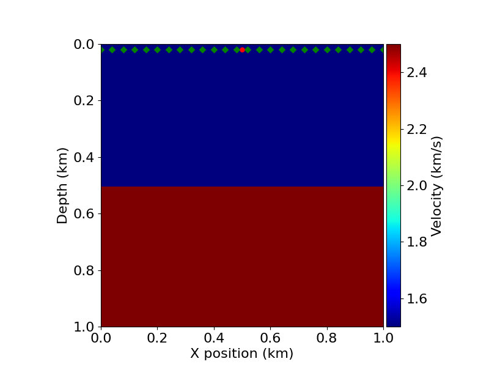
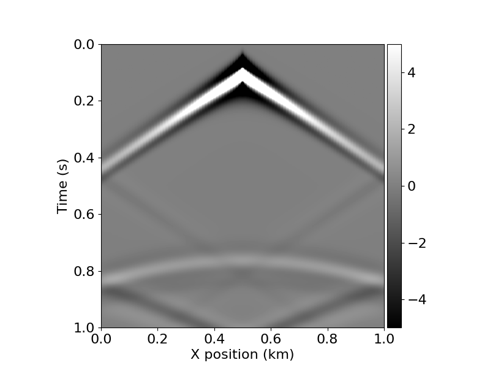

# Acoustic Wave Propagation

The implementation used in this example is based on [Devito's seismic modeling tutorial](https://github.com/devitocodes/devito/blob/master/examples/seismic/tutorials/01_modelling.ipynb). A detailed description of the problem and an introduction to seismic modeling can be found over there.

The goal here is to run the simulation of the acoustic wave propagation (a.k.a, forward modeling), using Devito.

## Source code

The source code to simulate the propagation of the acoustic wave using Devito is available in the [acoustic_wave_propagation.py](scripts/acoustic_wave_propagation.py) file.

It can also be downloaded from [https://omnivector-public-assets.s3.us-west-2.amazonaws.com/code/acoustic_wave_propagation.py](https://omnivector-public-assets.s3.us-west-2.amazonaws.com/code/acoustic_wave_propagation.py).

For example:

```
$ wget https://omnivector-public-assets.s3.us-west-2.amazonaws.com/code/acoustic_wave_propagation.py
```

## Job Script

The job script [job-script.sh](scripts/job-script.sh) does the following steps:

- Download the singularity image of Devito.
- Download the `acoustic_wave_propagation.py` script.
- Run the `acoustic_wave_propagation.py` script using singularity.

In a slurm cluster, you just need to submit the job script above, using:

```
sbatch job-script.sh
```

## Results

The results of the simulation should be in the `plots` directory. The script generates two images:

Velocity model with the acquisition geometry:



Shot record (or seismogram):




