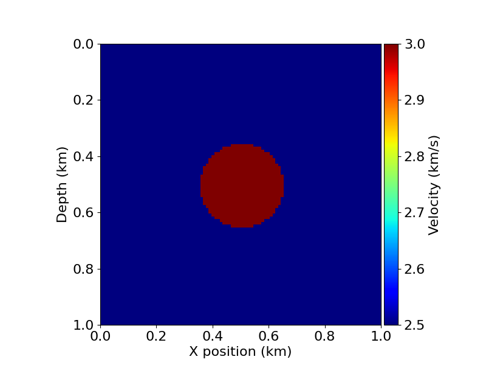
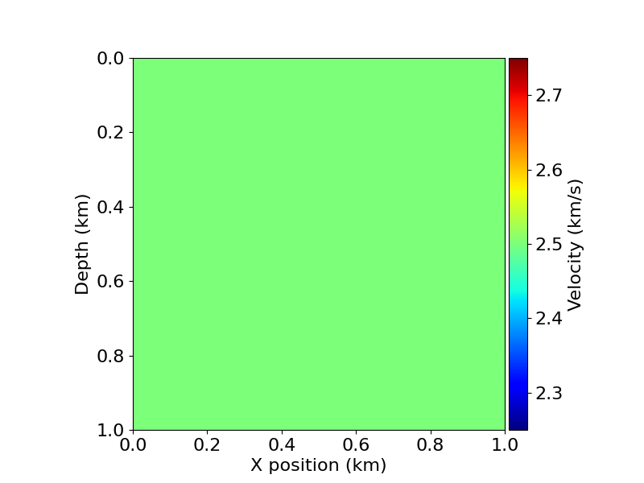
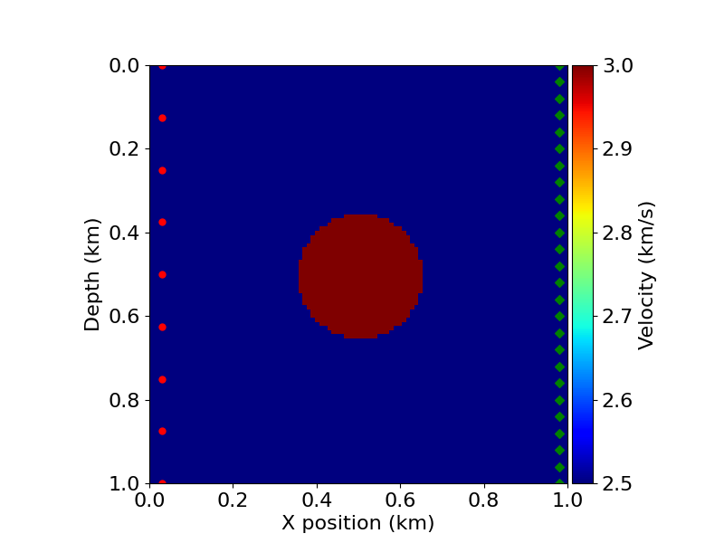
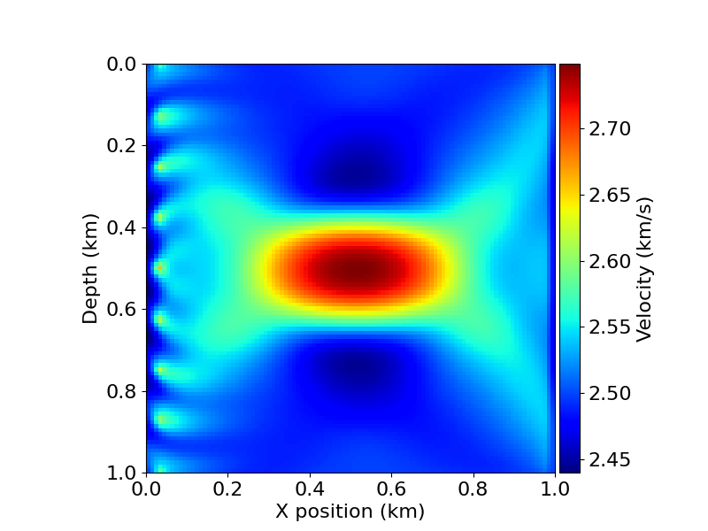
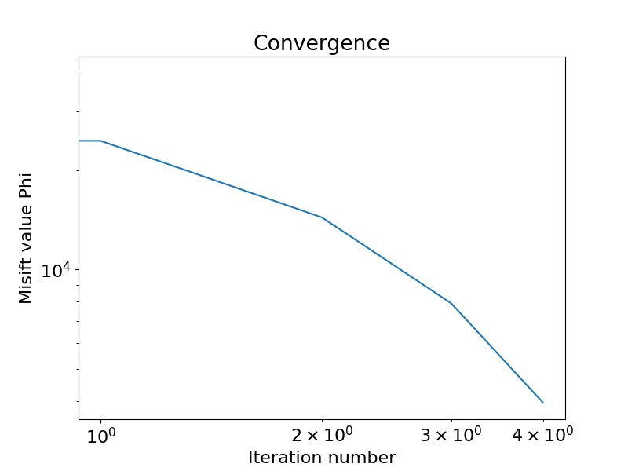

# Full-Waveform Inversion (FWI)

Full-Waveform Inversion (FWI) is a seismic inversion problem, that aims to create an image of the subsurface from field recorded data.

The implementation used in this example is based on [Devito's FWI tutorial](https://github.com/devitocodes/devito/blob/master/examples/seismic/tutorials/03_fwi.ipynb). A detailed description of the problem can be found over there.

The goal here is to run the FWI, using Devito.

## Source code

The source code to implement an FWI using Devito is available in the [fwi.py](scripts/fwi.py) file.

It can also be downloaded from [https://omnivector-public-assets.s3.us-west-2.amazonaws.com/code/fwi.py](https://omnivector-public-assets.s3.us-west-2.amazonaws.com/code/fwi.py).

For example:

```
$ wget https://omnivector-public-assets.s3.us-west-2.amazonaws.com/code/fwi.py
```

## Job Script

The job script [job-script.sh](scripts/job-script.sh) does the following steps:

- Download the singularity image of Devito.
- Download the `fwi.py` script.
- Run the `fwi.py` script using singularity.

In a slurm cluster, you just need to submit the job script above, using:

```
sbatch job-script.sh
```

## Results

The results of the simulation should be in the `plots` directory. The script generates five images:

True velocity model:



Initial velocity model:



Acquisition geometry:



Velocity model after 5 iterations:



Objective function over iterations:


