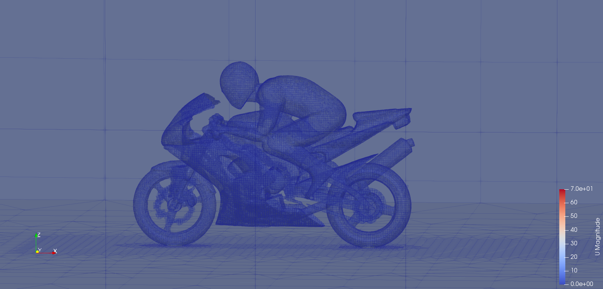

# OpenFOAM MotorBike Example

The motorbike example is an example workload provided by OpenFOAM that simulates airflow over a motorbike and it's rider.



This documentation provides a description of how to execute the motorbike example on a slurm cluster.

Summary:

- [Creating a Singularity Container with OpenFOAM v10](#creating-a-singularity-container-with-openfoam-v10)
- [Running the motorBike example on a slurm cluster](#running-the-motorbike-example-on-a-slurm-cluster)
    - [Prerequisites](#prerequisites)
    - [MotorBike code](#motorbike-code)  
    - [Running directly on the cluster](#running-directly-on-the-cluster)
    - [Using Jobbergate CLI](#using-jobbergate-cli)
- [Visualisation](#visualisation)
- [Configure a local LXD-deployed slurm cluster with charms](#configure-a-local-lxd-deployed-slurm-cluster-with-charms)

## Creating a Singularity Container with OpenFOAM v10

[Singularity](https://docs.sylabs.io/guides/3.10/user-guide/introduction.html) is a container platform for HPC environments. 

Using a container, we can build and install OpenFOAM v10 and it's dependencies and package up whatever we need into a single image file.

We can build an OpenFOAM v10 singularity image using docker or another singularity image as base. Here we are gonna use a docker image with OpenFOAM v10 and MPICH 3.2 built on top of a CentOS 7 operating system.

If you would like to build OpenFOAM v10 from source, the scripts are available below:

- [Build OpenFOAM from source - Ubuntu 20.04](scripts/build-openfoam-from-source-ubuntu.sh)
- [Build OpenFOAM from source - CentOS 7](scripts/build-openfoam-from-source-centos.sh)

To create a Singularity image for OpenFOAM, we must write a definition file for it.

For example, we can create the [`openfoam.def`](scripts/openfoam.def) file.

Now we use the `singularity build` command to create the singularity container image (`openfoam10.sif`)

```
singularity build -f openfoam10.sif openfoam.def
```


This `openfoam10.sif` is ready and available for download [here](https://omnivector-public-assets.s3.us-west-2.amazonaws.com/singularity/openfoam10.sif).

To download it, we can use:

```
curl -o openfoam10.sif --location "https://omnivector-public-assets.s3.us-west-2.amazonaws.com/singularity/openfoam10.sif"
```

or 

```
wget https://omnivector-public-assets.s3.us-west-2.amazonaws.com/singularity/openfoam10.sif
```


## Running the motorBike example on a slurm cluster

With a Singularity image file for OpenFOAM, we can run any OpenFOAM example without the need to have OpenFOAM built on the cluster's system.

To do that we need to access the cluster via ssh or use Jobbergate. It's describe below how do run the motorBike example using both approaches.

### Prerequisites

Make sure the cluster has MPI (to run the motorBike example in parallel) properly installed and configured. As the OpenFOAM in the container image was built along with MPICH, we need to have MPICH available in the cluster as well.

Thus, verify if the following commands runs:

```
$ mpicc --version

gcc (GCC) 9.3.1 20200408 (Red Hat 9.3.1-2)
Copyright (C) 2019 Free Software Foundation, Inc.
This is free software; see the source for copying conditions.  There is NO
warranty; not even for MERCHANTABILITY or FITNESS FOR A PARTICULAR PURPOSE.
```

Note that It does not have to be necessarily the same version of GCC compiler or even a GCC compiler. But the output must show any C compiler.

The following command must show some version of MPICH.

```
$ mpirun --version

HYDRA build details:
    Version:                                 3.2
    ...
    Process Manager:                         pmi
    Launchers available:                     ssh rsh fork slurm ll lsf sge manual persist
    Topology libraries available:            hwloc
    Resource management kernels available:   user slurm ll lsf sge pbs cobalt
    Checkpointing libraries available:       
    Demux engines available:                 poll select

```

If you do not have MPICH installed, you can easily install it with:

#### In Ubuntu: 

```
$ apt-get install -y mpich
```

#### In CentOS 7: 

```
$ yum install -y mpich-3.2 mpich-3.2-devel
```

Here you may need to load the MPICH module:

```
$ module load mpi/mpich-3.2-x86_64
```

The compute nodes must have a recent version of Singularity installed:

```
$ singularity version

3.10.0

```

If you do not have Singularity installed, you can easily install it with:

#### In Ubuntu: 

```
$ wget https://github.com/sylabs/singularity/releases/download/v3.10.2/singularity-ce_3.10.2-focal_amd64.deb
$ apt-get install -y ./singularity-ce_3.10.2-focal_amd64.deb
```

#### In CentOS 7: 

```
$ yum install -y https://github.com/sylabs/singularity/releases/download/v3.10.2/singularity-ce-3.10.2-1.el7.x86_64.rpm
```


### MotorBike code

In this tutorial, we are using OpenFOAM v10. A list of several OpenFoam v10 tutorials can be found in https://github.com/OpenFOAM/OpenFOAM-10

The motorBike example is located in https://github.com/OpenFOAM/OpenFOAM-10/tree/master/tutorials/incompressible/simpleFoam/motorBike

The job scripts below execute a few commands to:

- Download the singularity image of OpenFOAM v10
- Download the motorBike example from GitHub
- Run the steps to process the motorBike example

Note that the commands run in the `/nfs` directory, which is shared between the cluster nodes.

### Running directly on the cluster

Inside the cloud-deployed (or any other) slurm cluster, we just need to create a job script file and submit it, like:

#### Sequential

Here, we demonstrate how to run the motorBike example in a single processor (one task). Thus, for that we need only one compute node.

1) Create the [run-motorbike-sequential.sh](scripts/run-motorbike-sequential.sh) file.

2) Submit the job: 

```
$ sbatch run-motorbike-sequential.sh
```

#### Parallel (MPI)

For parallel execution, We are gonna need 6 tasks spread across 2 compute nodes (each node has 4 CPUs).

By default, the motorBike is decomposed in 6 processors. This is configurable in the [system/decomposeParDic](https://github.com/OpenFOAM/OpenFOAM-10/blob/master/tutorials/incompressible/simpleFoam/motorBike/system/decomposeParDict#L17) file. If so, the `n` key in the `hierarchicalCoeffs` dictonary in the same [file](https://github.com/OpenFOAM/OpenFOAM-10/blob/master/tutorials/incompressible/simpleFoam/motorBike/system/decomposeParDict#L26) also must be updated in a way that the product of the values is equal to the number of processors.

1) Create the [run-motorbike-parallel.sh](scripts/run-motorbike-parallel.sh) file.

2) Submit the job: 

```
$ sbatch run-motorbike-parallel.sh
```


### Using Jobbergate CLI

Here we are using Jobbergate CLI to submit the jobs to the cloud-deployed cluster.

First, we need to login:

```
$ jobbergate login
```

Once we are successfully logged, we can use Jobbergate to create applications and submit job scripts to the cluster.

Find bellow Jobbergate's application's templates for sequential and parallel executions: 

- [Sequential application](jobbergate/applications/sequential)

- [Parallel application](jobbergate/applications/parallel)

#### Sequential

Follow the steps bellow to submit jobs for execution in a ARMADA cluster using Jobbergate.

1) Create an application

```
$ jobbergate applications create --name <APPLICATION_NAME> --application-path <PATH/TO/APPLICATION_TEMPLATE> --application-desc <APPLICATION_DESCRIPTION>
```

For example:

```
$ jobbergate applications create --name motorbike-sequential --application-path jobbergate/applications/sequential --application-desc "OpenFOAM v10 MotorBike Sequential"
```

It's going to return something like:

```
               Created Application                      
┏━━━━━━━━━━━━━━━━━━━━━━━━━┳━━━━━━━━━━━━━━━━━━━━━━━━━━━━━━━━━━━┓
┃ Key                     ┃ Value                             ┃
┡━━━━━━━━━━━━━━━━━━━━━━━━━╇━━━━━━━━━━━━━━━━━━━━━━━━━━━━━━━━━━━┩
│ id                      │ 121                               │
│ application_name        │ motorbike-sequential              │
│ application_identifier  │ None                              │
│ application_description │ OpenFOAM v10 MotorBike Sequential │
│ application_owner_email │ user@omnivector.solutions         │
│ application_uploaded    │ True                              │
└─────────────────────────┴───────────────────────────────────┘

```

2) Create a job script

```
$ jobbergate job-scripts create --name <JOB_SCRIPT_NAME> --application-id <APPLICATION_ID>
```

For example:

```
$ jobbergate job-scripts create --name job-motorbike-sequential --application-id 121
```

It's gonna ask you to choose the partition's name. Type `aws` and enter.

```
[?] Choose a partition: aws
```

It's going to return something like:

```
Created Job Script                   
┏━━━━━━━━━━━━━━━━━━━━━━━━┳━━━━━━━━━━━━━━━━━━━━━━━━━━━━┓
┃ Key                    ┃ Value                      ┃
┡━━━━━━━━━━━━━━━━━━━━━━━━╇━━━━━━━━━━━━━━━━━━━━━━━━━━━━┩
│ id                     │ 78                         │
│ application_id         │ 121                        │
│ job_script_name        │ job-motorbike-sequential   │
│ job_script_description │ None                       │
│ job_script_owner_email │ user@omnivector.solutions  │
└────────────────────────┴────────────────────────────┘
```

3) Create a job submission

```
$ jobbergate job-submissions create --name <SUBMISSION_NAME> --description <SUBMISSION_DESCRIPTION> --job-script-id <JOB_SCRIPT_ID> --cluster-name <CLUSTER_NAME>
```

For example:

```
$ jobbergate job-submissions create --name submit-motorbike-sequential --description "Run motorBike sequential" --job-script-id 78 --cluster-name aws-cluster-1
```

It's going to return something like:

```
Created Job Submission                   
┏━━━━━━━━━━━━━━━━━━━━━━━━━━━━┳━━━━━━━━━━━━━━━━━━━━━━━━━━━━━┓
┃ Key                        ┃ Value                       ┃
┡━━━━━━━━━━━━━━━━━━━━━━━━━━━━╇━━━━━━━━━━━━━━━━━━━━━━━━━━━━━┩
│ id                         │ 37                          │
│ job_script_id              │ 78                          │
│ client_id                  │ aws-cluster-1               │
│ slurm_job_id               │ None                        │
│ execution_directory        │ None                        │
│ job_submission_name        │ submit-motorbike-sequential │
│ job_submission_description │ Run motorBike sequential    │
│ job_submission_owner_email │ user@omnivector.solutions   │
│ status                     │ CREATED                     │
└────────────────────────────┴─────────────────────────────┘
```

4) We can see the job submission status with:

```
$ jobbergate job-submissions get-one --id <JOB_SUBMISSION_ID>
```

For example:

```
$ jobbergate job-submissions get-one --id 37
```

It's going to return something like:

```
Job Submission                       
┏━━━━━━━━━━━━━━━━━━━━━━━━━━━━┳━━━━━━━━━━━━━━━━━━━━━━━━━━━━━┓
┃ Key                        ┃ Value                       ┃
┡━━━━━━━━━━━━━━━━━━━━━━━━━━━━╇━━━━━━━━━━━━━━━━━━━━━━━━━━━━━┩
│ id                         │ 37                          │
│ job_script_id              │ 78                          │
│ client_id                  │ aws-cluster-1               │
│ slurm_job_id               │ 38                          │
│ execution_directory        │ None                        │
│ job_submission_name        │ submit-motorbike-sequential │
│ job_submission_description │ Run motorBike sequential    │
│ job_submission_owner_email │ user@omnivector.solutions   │
│ status                     │ SUBMITTED                   │
└────────────────────────────┴─────────────────────────────┘

```

#### Parallel (MPI)

The steps are the same as described above for the sequential execution. The only difference is the path to the application:

For example:

```
$ jobbergate applications create --name motorbike-parallel --application-path jobbergate/applications/parallel --application-desc "OpenFOAM v10 MotorBike Parallel"
```

## Visualisation

To view the result after computation, we must download the `motorBike` directory to our local system and run the `paraFoam` command inside that directory.

It will open up the resulting mesh on Paraview.

OBS.: To do that, we need to have OpenFOAM installed along with Paraview in the local system.

If you do not have OpenFOAM installed, but you have Paraview, you must create a file inside `motorBike` directory and named it `<ANY_FILE_NAME>.foam` (no content needed) and open it in Paraview, which will automatically identify the result files inside the folder and render them:
```
touch motorBike.foam
```

## Configure a local LXD-deployed slurm cluster with charms

You can deploy a local slurm cluster using Juju and LXD. 

[Here](charms-lxd-slurm-cluster) we show how set up the local cluster to run the motorBike example.


